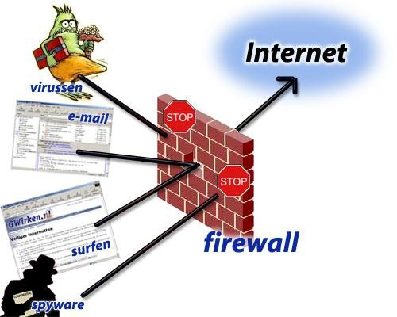

 
 # **Introduction**
  **Firewall** is a software or a code or a piece of hardware which are implemented to protect against attacks that hamper   our resources including data over the network. It is used to prevent unauthorized internet users from accesing private networks connected to the internet.

  
  
Fig 1.

In simple words, firewall's main purpose is to allow non-threatening traffic/messages in and to keep dangerous traffic out.

## **Why We Need Firewall ?**

Let's take a scenario, suppose you are going somewhere in the mall. When you reached there, you are going to be entered from the entry gate and there is a sensor as a barrier that is used to detect all metal items like knives, guns, or something else which may come in the use to harm/attack some other. So, while entering with these metal items, a metal detector/barrier will immediately detect and rang a buzzer, it means that you will not be getting allowed inside the mall with such type of things.

The same thing firewall works in computer programs. Firewalls act as a safety barrier between a private network and the public internet. Because out on the internet, there's always going to be hackers and malicious traffic that may try to penetrate a private network to cause harm. And firewall is going to be used to prevent this. It is especially important to a large organization that has a lot of computers are there and servers in them. Because we don't want all those devices accessible to everyone on the internet where a hacker can come in and disrupt that organization.

So, that's why we need a firewall to protect them.

## **Types of Firewall**

Firewalls can either be software or hardware, though it’s best to have both. A software firewall is a program installed on each computer and regulates traffic through port numbers and applications, while a physical firewall is a piece of equipment installed between your network and gateway.

Various types of firewell are there :

* ### Proxy Firewall 
*  ### Packet-filtering firewalls
*  ### Stateful Multi-layer Inspection Firewall
*  ### Unified Threat Management Firewall
*  ### Next-generation Firewall
*  ### Network Address Translation Firewall

**<u class="tt"># Proxy Firewall : -</u>**
It is a network security system which is used to protects while filtering messages at the application layer
 

**<u class="tt"># Packet filtering Firewall : -</u>**
It is a software that notices all the incoming packets and decide whether to allow them to pass or reject them.
 

**<u class="tt"># Stateful Multi-layer Inspection Firewall : -</u>**
It is a software that examines/scan/inspects packet headers and IP address, and checks the validity of the connection throughout the session
 

## To Know more about in a brief you can go through this various website also which are given below :

[JavaTpoint]{https://www.javatpoint.com/firewall}